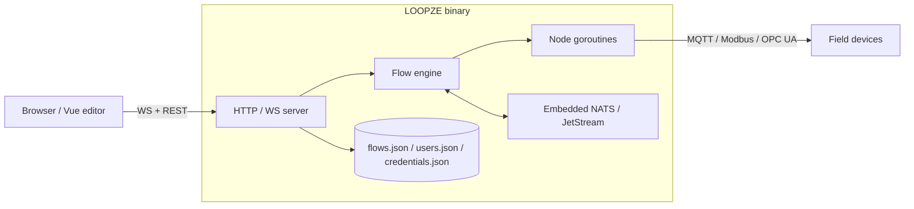

# Architecture

LOOPZE is intentionally small: one Go binary, one embedded frontend, one
embedded message broker.

## Repository layout

```
loopze-edge/
├── cmd/loopze/         # Application entry point
├── internal/
│   ├── api/            # REST API handlers and routes
│   ├── auth/           # User identity, sessions, role middleware
│   ├── config/         # Configuration management
│   ├── credentials/    # Encrypted credential storage
│   ├── flow/           # Runtime engine, types, node registry
│   ├── server/         # HTTP server setup and middleware
│   ├── storage/        # Flow / credential / user file persistence
│   └── ws/             # WebSocket hub for real-time communication
├── frontend/           # Vue 3 + Vue Flow editor (built into web/dist)
├── web/                # Embedded frontend assets (go:embed)
├── docs/               # This documentation site
├── go.mod
└── Makefile
```

## Process model



- The HTTP server hosts the embedded editor *and* the REST + WebSocket APIs.
- The flow engine spawns one goroutine per node.
- An embedded NATS server (JetStream-enabled) handles context storage,
  debug streams and — eventually — fleet communication.

## Decisions log

All major architecture and technology decisions are tracked in
[`DECISIONS.md`](https://github.com/loopzedev/loopze-edge/blob/main/DECISIONS.md)
in the repository root.
