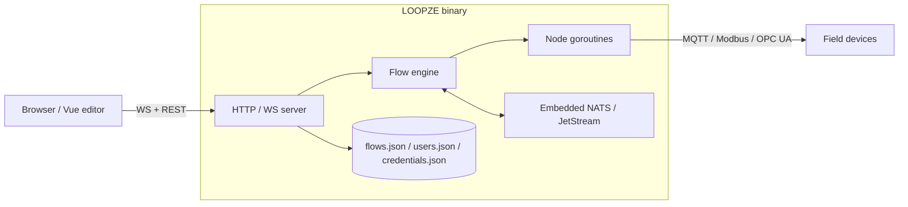

# Architecture

LOOPZE is intentionally small: one Go binary, one embedded frontend, one
embedded message broker.

## Repository layout

```
loopze-edge/
├── cmd/loopze/         # Application entry point + bundled-groups manifest
├── internal/
│   ├── api/            # REST API handlers and routes
│   ├── auth/           # User identity, sessions, role middleware
│   ├── config/         # Configuration management
│   ├── credentials/    # Encrypted credential storage
│   ├── flow/           # Runtime engine, types, node registry
│   ├── nodes/          # Node implementations (see "Node groups" below)
│   ├── server/         # HTTP server setup and middleware
│   ├── storage/        # Flow / credential / user file persistence
│   └── ws/             # WebSocket hub for real-time communication
├── frontend/           # Vue 3 + Vue Flow editor (built into web/dist)
├── web/                # Embedded frontend assets (go:embed)
├── docs/               # This documentation site
├── go.mod
└── Makefile
```

### Node groups

Every node ships in a self-contained subpackage that owns its Go
implementation, tests, and frontend editors. The two trees mirror each other:

```
internal/nodes/             frontend/src/nodes/
├── base.go                 ├── types.ts
├── registry.go             ├── index.ts          (aggregator)
├── conv.go / props.go      ├── core/
├── tls_config.go           ├── modbus/
├── valuetype.go            ├── mqtt/
├── nodestest/              ├── network/
├── core/                   ├── opcua/
├── modbus/                 └── s7/
├── mqtt/
├── network/
├── opcua/
└── s7/
```

A subpackage is **the** unit of contribution. Each one has:

- An `init.go` that calls `nodes.RegisterGroup(...)` to declare the node
  types it provides (and any config-node types).
- A matching frontend folder with an `index.ts` exporting a
  `NodeGroupManifest` (config editors, palette categories, optional
  group-specific enums).
- A `name` field that ties the two halves together — `internal/nodes/s7/`
  registers group `"s7"` and `frontend/src/nodes/s7/index.ts` declares
  `name: 's7'`. That string is the only handshake.

Which groups end up in the binary is controlled by blank imports in
`cmd/loopze/groups.go`. Removing a line strips the group from the build.
At runtime, `nodes.GroupSelection` (passed by `internal/server`) can
further enable/disable groups via configuration.

See [Adding a node](../contributing/adding-a-node.md) for the full
contributor walkthrough.

## Process model



- The HTTP server hosts the embedded editor *and* the REST + WebSocket APIs.
- The flow engine spawns one goroutine per node.
- An embedded NATS server (JetStream-enabled) handles context storage,
  debug streams and — eventually — fleet communication.

## Decisions log

All major architecture and technology decisions are tracked in
[`DECISIONS.md`](https://github.com/loopzedev/loopze-edge/blob/main/DECISIONS.md)
in the repository root.
